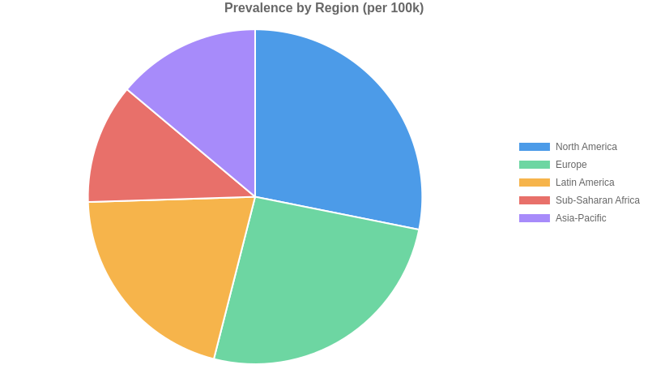
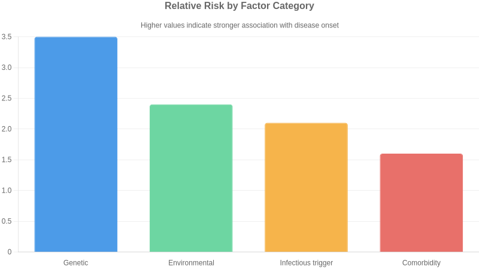
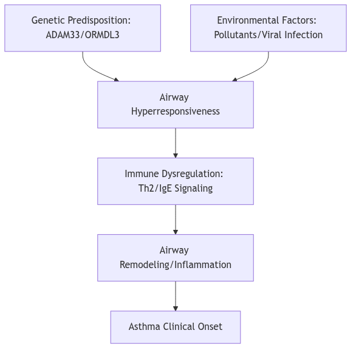
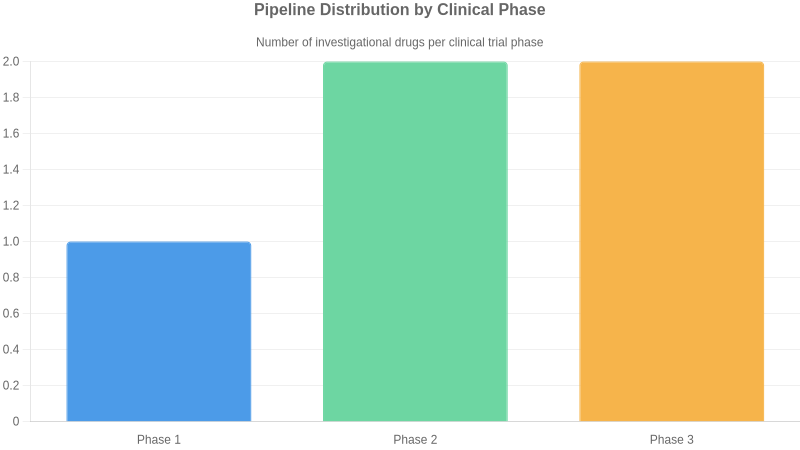

# Asthma

**Comprehensive pharmaceutical disease landscape report covering epidemiology, pathophysiology, clinical presentation, diagnosis, treatment, pipeline and market dynamics**

**Prepared by:** Aganitha Cognitive Solutions
**Generated:** 14 May 2026
**Classification:** Confidential — For Internal Research Use Only

---

## Table of Contents

1. [Disease Overview](#disease-overview)
2. [Epidemiology](#epidemiology)
3. [Etiology & Risk Factors](#etiology--risk-factors)
4. [Pathophysiology & Mechanism](#pathophysiology--mechanism)
5. [Clinical Presentation](#clinical-presentation)
6. [Diagnosis](#diagnosis)
7. [Current Treatment Landscape](#current-treatment-landscape)
8. [Pipeline & Emerging Therapies](#pipeline--emerging-therapies)
9. [Market & Access Landscape](#market--access-landscape)
10. [Key Insights & Future Outlook](#key-insights--future-outlook)

---

## Disease Overview

Asthma is a chronic inflammatory disorder of the lower respiratory tract, characterized by reversible airway obstruction and bronchial hyper-responsiveness. The pathophysiology involves structural changes to the airway walls, including mucosal edema, mucus hypersecretion, and smooth muscle hypertrophy. Clinically, patients present with recurrent episodes of wheezing, dyspnea, chest tightness, and coughing, often exacerbated by environmental triggers. It is a multi-system condition in its impact, as chronic airway inflammation limits pulmonary gas exchange and systemic oxygenation. While the underlying inflammation is persistent, symptoms fluctuate in severity over time, necessitating long-term pharmacological management to maintain airflow patency and prevent acute exacerbations.

The term asthma is derived from the Greek word for 'panting' or 'gasping.' Historically, it was sometimes conflated with cardiac-related respiratory distress, known as 'cardiac asthma.' Modern medical terminology strictly differentiates asthma as a distinct obstructive pulmonary condition, though 'occupational asthma' and 'exercise-induced bronchoconstriction' are now used as specific diagnostic descriptors rather than separate disease entities.

### Icd Codes

- J45 (ICD-10) — Asthma
- CA23 (ICD-11) — Asthma

### Subtypes

| Name | Description | Severity |
| --- | --- | --- |
| Allergic Asthma | Triggered by inhalation of allergens such as pollen, dust mites, or pet dander, leading to an IgE-mediated immune response. | moderate |
| Non-allergic Asthma | Induced by factors other than allergens, such as cold air, viral infections, or exercise; typically appears later in life. | moderate |
| Severe Refractory Asthma | Persistent symptoms despite high-dose inhaled corticosteroids and long-acting beta-agonists, requiring specialized biological therapies. | severe |
| Occupational Asthma | Triggered by exposure to specific irritants or sensitizing agents present in the workplace environment. | moderate |

### Historical Milestones

| Year | Event |
| --- | --- |
| 460 | Hippocrates first uses the term 'asthma' to describe short-drawn, panting respiration. |
| 1698 | Sir John Floyer publishes 'A Treatise of the Asthma', detailing the disease's clinical signs. |
| 1859 | Henry Hyde Salter publishes the first comprehensive clinical account of the disease in 'On Asthma: Its Pathology and Treatment'. |
| 1903 | Sir Henry Dale identifies histamine as a potent substance capable of inducing bronchoconstriction. |
| 1967 | Kimishige and Teruko Ishizaka discover Immunoglobulin E (IgE), identifying the mechanism behind allergic reactions. |
| 1970 | Introduction of the first selective beta-2 adrenergic agonists for rapid bronchodilation. |

---

## Epidemiology

### Prevalence

Approximately 262 million people affected globally (2019 estimate); average global prevalence is approximately 3.4% of the population

### Incidence Rate

Data not established as a single global metric due to high regional variance and under-diagnosis; estimated 150 to 400 per 100,000 in pediatric populations

### Geographic Distribution

| Region | Prevalence Per 100k | Notes |
| --- | --- | --- |
| North America | 8500 | Higher prevalence observed in urban centers and among lower socioeconomic groups |
| Europe | 7800 | Variability between Western and Eastern Europe; generally higher in the UK and Australia |
| Latin America | 6200 | Significant under-diagnosis in rural areas |
| Sub-Saharan Africa | 3500 | Historically reported lower rates, though prevalence is rising with urbanization |
| Asia-Pacific | 4200 | Rates are rapidly increasing in newly industrialized regions |

### Demographics

**Age Groups:** Highest prevalence in pediatric populations (5-14 years); secondary peak in elderly populations

**Sex Distribution:** More prevalent in boys than girls in childhood; trend reverses to higher prevalence in women during adulthood

**Socioeconomic Factors:** Strong inverse correlation between asthma-related mortality/morbidity and socioeconomic status

### Mortality Rate

Approximately 455,000 deaths annually worldwide; mortality is significantly higher in low- and middle-income countries due to limited access to inhaled corticosteroids

### Burden Of Disease

**Daly Impact:** Estimated 24.8 million DALYs lost annually due to asthma

**Economic Impact:** Direct medical costs combined with indirect productivity losses estimated at $80 billion USD annually in the United States alone

---

## Etiology & Risk Factors

Asthma pathogenesis involves a complex interplay between a susceptible genetic background and environmental exposures. Individuals often harbor specific polymorphisms in genes such as ADAM33 or ORMDL3, which influence airway remodeling and bronchial hyperresponsiveness. These genetic predispositions set a foundation of susceptibility, but the transition to clinical disease typically requires environmental hits—particularly during critical developmental windows—such as viral respiratory infections or chronic exposure to particulate matter and indoor allergens.

The resulting immune dysregulation is characterized by a predominance of Type 2 inflammation, involving T-helper 2 cells, eosinophils, and mast cells. When environmental triggers act upon the sensitized airway epithelium, they promote the release of alarmins like IL-33 and TSLP. This initiates a cascade of IgE-mediated hypersensitivity and chronic inflammatory infiltration, leading to structural changes in the airway wall, including goblet cell hyperplasia and subepithelial fibrosis. The synergy between innate susceptibility and repeated external stimuli results in the clinical phenotype of reversible airflow obstruction.

Clinically significant triggers commonly incite acute exacerbations in established disease. Viral respiratory infections, particularly rhinovirus, remain the primary instigators of acute airway inflammation. Inhalation of perennial or seasonal allergens—such as house dust mites, animal dander, or pollens—provokes immediate bronchospasm via IgE-mediated mast cell degranulation. Furthermore, non-specific irritants including cold, dry air, exercise-induced dehydration of the airway surface liquid, and inhalation of tobacco smoke or combustion byproducts serve as potent modifiers that acutely increase airway resistance and provoke symptoms in patients with hyper-responsive airway smooth muscle.

### Genetic Causes

- ADAM33 gene polymorphism
- ORMDL3 expression variants
- HLA-G gene variants
- IL-33 receptor signaling mutations
- TSLP gene polymorphisms

### Environmental Factors

- exposure to tobacco smoke
- indoor air pollutants including nitrogen dioxide
- occupational exposure to sensitizing agents
- early-life viral respiratory infections
- urban air pollution (PM2.5)

### Infectious Autoimmune Triggers

- Respiratory Syncytial Virus (RSV) infection
- Rhinovirus-induced exacerbations
- Th2-mediated inflammatory pathway dysregulation
- IgE-mediated hypersensitivity

### Comorbidities

- allergic rhinitis
- atopic dermatitis
- obesity
- gastroesophageal reflux disease
- obstructive sleep apnea

### Risk Score By Factor

| Factor | Relative Risk | Confidence |
| --- | --- | --- |
| Genetic | 3.5 | high |
| Environmental | 2.4 | high |
| Infectious trigger | 2.1 | medium |
| Comorbidity | 1.6 | medium |

---

## Pathophysiology & Mechanism

> ⚠️ JSON Parse error: Expected '}'

---

## Clinical Presentation

The natural history of asthma is highly heterogeneous, characterized by intermittent periods of exacerbation and symptom-free intervals. Many pediatric patients experience clinical remission or significant improvement by late adolescence, though symptoms may persist or relapse in adulthood. In adults, asthma is typically a chronic, lifelong condition requiring sustained management. Prognosis is heavily influenced by the inflammatory phenotype, adherence to controller therapies, and environmental trigger exposure. Chronic, uncontrolled inflammation may lead to irreversible airway remodeling, resulting in progressive decline in FEV1 and fixed airflow obstruction. While mortality rates remain low in well-managed populations, severe exacerbations carry risk for emergency intervention and fatality. Quality of life is profoundly impacted by uncontrolled symptoms, specifically through sleep disruption, exercise intolerance, and work or school absenteeism. Early diagnosis and the implementation of personalized, stepwise pharmacological interventions are critical to mitigating long-term structural lung changes and preserving pulmonary function.

### Symptoms

| Symptom | Frequency | Severity |
| --- | --- | --- |
| Wheezing | very common | variable |
| Dyspnea | very common | variable |
| Chest tightness | common | moderate |
| Cough | common | mild to moderate |
| Nocturnal awakening | common | moderate |
| Status asthmaticus | rare | severe |

### Disease Stages

| Name | Severity | Key Features | Typical Duration |
| --- | --- | --- | --- |
| Intermittent | mild | Symptoms less than twice weekly, nocturnal symptoms twice or less monthly, normal lung function between exacerbations. | Chronic |
| Mild Persistent | mild | Symptoms more than twice weekly but less than daily, nocturnal symptoms 3-4 times monthly. | Chronic |
| Moderate Persistent | moderate | Daily symptoms, daily use of inhaled short-acting beta-agonists, nocturnal symptoms more than once weekly. | Chronic |
| Severe Persistent | severe | Symptoms throughout the day, frequent nocturnal symptoms, limited physical activity, FEV1 <60% predicted. | Chronic |

### Complications

| Complication | Risk Level | Associated Stage |
| --- | --- | --- |
| Airway remodeling | moderate | Persistent |
| Respiratory failure | high | Severe |
| Pneumothorax | low | Severe |
| Atelectasis | moderate | Severe |

---

## Diagnosis

Differentiating asthma from other respiratory and cardiac conditions is critical for effective management. Chronic obstructive pulmonary disease (COPD) is the primary differential, characterized by persistent, largely irreversible airflow limitation and typically later onset in patients with significant smoking history. Vocal cord dysfunction (VCD) often mimics severe asthma but presents with stridor and fixed airflow obstruction on flow-volume loops. Cardiac failure must be considered in elderly patients, where orthopnea and nocturnal dyspnea overlap with asthma, but physical examination reveals bibasilar rales and elevated BNP levels. Additionally, bronchiectasis is distinguished by productive cough and characteristic findings on high-resolution computed tomography. Clinicians must utilize bronchodilator responsiveness and longitudinal symptom monitoring to differentiate these conditions from the inherently variable airway obstruction found in asthma.

There is no standardized universal screening program for asthma. Early detection relies on clinical suspicion in patients presenting with recurrent cough, wheeze, or exertional dyspnea. Current strategies emphasize the use of standardized asthma control questionnaires and symptom-based checklists during routine primary care encounters. A significant gap exists in pediatric populations and low-resource settings, where under-diagnosis persists due to lack of access to spirometry. Early detection is hampered by the normalization of respiratory symptoms by patients, leading to delayed presentation. Future efforts are focusing on the integration of digital health tools and mobile spirometry in high-risk pediatric cohorts to identify disease markers before the development of irreversible airway remodeling.

### Diagnostic Criteria

- GINA (Global Initiative for Asthma) 2023: History of variable respiratory symptoms (wheeze, shortness of breath, chest tightness, cough) that vary over time and in intensity
- GINA 2023: Evidence of variable expiratory airflow limitation confirmed by pre- and post-bronchodilator spirometry (FEV1/FVC < lower limit of normal or <0.75-0.80)
- Significant reversibility defined as FEV1 increase of >12% and >200mL after 200-400mcg salbutamol inhalation

### Laboratory Tests

| Test | Description |
| --- | --- |
| Spirometry | Gold standard for establishing airflow obstruction and confirming significant bronchodilator reversibility |
| Fractional exhaled nitric oxide (FeNO) | Biomarker of airway inflammation; used to support diagnosis in patients with diagnostic uncertainty and evaluate corticosteroid responsiveness |
| Bronchial provocation testing (methacholine/mannitol) | Used to exclude asthma in patients with suggestive symptoms but normal baseline spirometry; demonstrates airway hyperresponsiveness |
| Serum total and allergen-specific IgE | Assesses for atopic status, which frequently co-occurs with asthma and may guide phenotype classification |

### Imaging Pathology

| Modality | Purpose | Findings |
| --- | --- | --- |
| Chest Radiography | Primary tool to exclude alternative pulmonary diagnoses | Usually normal in asthma; may reveal hyperinflation during acute exacerbations |

---

## Current Treatment Landscape

The current standard of care for asthma focuses on a stepwise management approach to achieve symptom control and minimize exacerbation risk. Initial treatment typically involves low-dose inhaled corticosteroids (ICS) combined with as-needed inhaled bronchodilators to address underlying airway inflammation and reversible obstruction. Treatment decisions are guided by symptom frequency, lung function assessment, and history of exacerbations. For patients with persistent symptoms despite optimized ICS use, therapy is escalated to include long-acting beta2-agonists (LABA) and long-acting muscarinic antagonists (LAMA). In cases of severe, uncontrolled asthma, phenotype-driven biologic therapies—targeted at IgE, IL-5, or IL-4/IL-13 pathways—are utilized to modulate the specific inflammatory endotype. The overarching clinical philosophy prioritizes achieving disease control while minimizing the requirement for systemic oral corticosteroids, which are associated with significant long-term adverse effects. Regular reassessment of inhaler technique and adherence is fundamental to the treatment sequence to ensure efficacy before considering therapy step-up.

Non-pharmacologic management is integral to long-term asthma control. Environmental control measures aim to reduce exposure to known triggers such as allergens, tobacco smoke, and occupational irritants. For patients with severe, persistent asthma, bronchial thermoplasty is an available interventional procedure that uses radiofrequency energy to reduce excessive airway smooth muscle, potentially decreasing the frequency of exacerbations. Patient education focused on self-management plans, proper inhaler technique, and regular lung function monitoring (spirometry) is essential for effective symptom control. Additionally, smoking cessation programs, weight management for obese asthmatic phenotypes, and physical activity promotion are strongly encouraged to improve overall respiratory health and quality of life.

Global management is primarily driven by the Global Initiative for Asthma (GINA) strategy report, which is updated annually. GINA guidelines emphasize the preference for ICS-formoterol as the controller therapy even in mild asthma to reduce exacerbation risk. The National Asthma Education and Prevention Program (NAEPP) Expert Panel Reports also provide widely adopted evidence-based recommendations in the United States. These guidelines consistently highlight the shift toward precision medicine, advocating for the use of biomarkers—such as blood eosinophil counts and fractional exhaled nitric oxide (FeNO)—to inform the selection of targeted biologic therapies in severe patient populations.

Significant unmet needs persist, particularly in the management of severe, non-type 2, or 'low-T2' asthma, where currently available biologics targeting eosinophilic or allergic pathways demonstrate limited efficacy. Patients with airway remodeling and fixed airflow obstruction remain challenging to treat, as current pharmacotherapy primarily addresses acute inflammation rather than underlying structural changes. Furthermore, there is a lack of reliable biomarkers to predict individual treatment responses to specific biologics, leading to a 'trial and error' approach that delays optimal symptom control. Underserved populations, including those in low-resource settings and patients with comorbid obesity, face substantial barriers to accessing advanced biologics and consistent primary care. Finally, the burden of therapy adherence continues to hamper clinical success, necessitating the development of long-acting, less frequent administration schedules and improved diagnostic tools for earlier, more accurate phenotyping.

### Approved Drugs

| Name | Class | Line Of Therapy | Mechanism |
| --- | --- | --- | --- |
| Inhaled Corticosteroids (ICS) | Corticosteroids | first | Reduces airway inflammation by suppressing cytokine production and eosinophilic recruitment |
| Short-acting beta2-agonists (SABA) | Beta2-adrenergic agonists | first | Induces rapid bronchodilation via stimulation of beta2-receptors on airway smooth muscle |
| Omalizumab | Biologic — Anti-IgE | third | Binds to free human IgE, preventing binding to high-affinity IgE receptors on mast cells and basophils |
| Mepolizumab | Biologic — Anti-IL-5 | third | Inhibits IL-5 signaling, thereby reducing the production and survival of eosinophils |
| Dupilumab | Biologic — IL-4/IL-13 inhibitor | third | Blocks the IL-4 receptor alpha subunit, inhibiting downstream signaling of both IL-4 and IL-13 |

---

## Pipeline & Emerging Therapies

The asthma therapeutic pipeline is shifting from broad immunosuppression toward precision medicine targeting upstream epithelial-derived cytokines. Novel modalities include monoclonal antibodies targeting alarmins like TSLP, IL-33, and the ST2 receptor. By blocking these early initiators of the inflammatory cascade, these biologics offer the potential to address asthma exacerbations in patients who are refractory to standard-of-care inhaled corticosteroids and current Th2-targeted biologics. Furthermore, small molecule innovation remains active; dual-action agents such as PDE3/PDE4 inhibitors are in late-stage development, offering a non-biologic, nebulized approach to bronchodilation and anti-inflammatory control. These approaches aim to reduce corticosteroid dependency and improve lung function in patients with severe disease, where current therapies frequently fail to mitigate airway remodeling and chronic hyper-responsiveness.

Key drivers in the asthma pipeline include major pharmaceutical entities such as AstraZeneca, Amgen, Sanofi, and Regeneron. These firms often utilize strategic collaborations to leverage proprietary platform technologies, such as Sanofi and Regeneron’s long-standing partnership focusing on cytokine-targeted monoclonal antibodies. Mid-cap biotechs like Verona Pharma are carving out niches in the inhaled small molecule space, representing a competitive alternative to injection-based biologic therapies. Licensing deals remain common as larger entities look to bolster their respiratory franchises with innovative mechanisms aimed at non-eosinophilic and refractory subtypes.

The clinical trial landscape for asthma is increasingly focused on biomarker-stratified recruitment to ensure targeted efficacy in heterogeneous patient populations. Primary endpoints have evolved beyond basic FEV1 measurements, now incorporating annualized exacerbation rates, asthma control questionnaires, and reduction in systemic corticosteroid requirements. Regulatory bodies are demanding higher bars for safety and durability, particularly as trials move toward long-term maintenance data. A significant challenge remains in recruiting patients with non-atopic or non-type 2-high asthma, where clear phenotypic definitions are still emerging, often leading to trial complexity and increased patient screening failure rates.

### Investigational Drugs

| Drug | Phase | Company | Modality | Status | Indication |
| --- | --- | --- | --- | --- | --- |
| Tezepelumab | 3 | AstraZeneca/Amgen | Biologic — TSLP inhibitor | Approved for severe asthma | Severe uncontrolled asthma |
| Itepekimab | 2 | Sanofi/Regeneron | Biologic — Anti-IL-33 monoclonal antibody | Active recruiting | Moderate to severe asthma |
| Astegolimab | 2 | Genentech | Biologic — Anti-ST2 monoclonal antibody | Active recruiting | Moderate to severe asthma |
| RPL554 (Ensifentrine) | 3 | Verona Pharma | Small molecule — Dual PDE3/PDE4 inhibitor | Under regulatory review | Maintenance treatment of COPD and asthma |
| SAR443122 | 1 | Sanofi | Biologic — Anti-IL-13/IL-33 trap | Active | Refractory asthma |

### Phase Distribution

| Phase | Count |
| --- | --- |
| Phase 1 | 1 |
| Phase 2 | 2 |
| Phase 3 | 2 |

---

## Market & Access Landscape

Reimbursement for asthma therapies follows a tiered structure, with generic inhaled corticosteroids and bronchodilators widely accessible. However, high-cost biologics face significant access barriers, requiring strict step-therapy protocols and proof of eosinophilic or allergic phenotypes for prior authorization. In the United States, payer dynamics are heavily influenced by complex rebate structures and formulary exclusions. European markets often utilize Health Technology Assessment (HTA) bodies to limit access based on cost-effectiveness thresholds, frequently restricting use to specialized care centers. Emerging markets face the most severe disparities, where the high price point of biologic agents renders them inaccessible to the broader patient population, limiting usage to narrow, affluent segments. Consequently, global patient access remains inequitable, with management of severe asthma failing to reach significant portions of the global population, perpetuating reliance on symptomatic rescue medication despite superior outcomes offered by modern biologics.

The asthma market is characterized by a transition from traditional controller therapies to targeted biologic agents. Key incumbents include AstraZeneca (Tezepelumab, Fasenra), GSK (Nucala), Sanofi/Regeneron (Dupilumab), and Novartis (Xolair). Competition is currently driven by the push to expand labels into broader severe asthma populations and the pursuit of earlier intervention protocols. The primary strategic frontier lies in addressing 'low-T2' or non-eosinophilic asthma, a space where current biologics offer limited efficacy. Consequently, the pipeline is shifting toward upstream cytokine inhibitors (e.g., TSLP, IL-33 pathway targeting) and novel mechanisms that address airway remodeling. As biosimilar entry increases for legacy biologics, the competitive pressure on pricing is intensifying, forcing established players to prioritize clinical differentiation in pediatric subgroups and long-term safety data to maintain market share against aggressive portfolio expansion from biotech challengers.

### Market Size

**Global Market Value 2022:** Approximately 20.5 billion USD

**Forecasted Cagr:** 4.1% through 2030

**Notes:** Market expansion is driven by the increasing uptake of high-cost biologic therapies for severe asthma and rising disease prevalence in emerging economies.

### Regulatory Status

| Drug | Region | Status |
| --- | --- | --- |
| Omalizumab | Global (USA, EU, Japan) | FDA/EMA approved for moderate to severe persistent allergic asthma |
| Mepolizumab | Global (USA, EU) | FDA/EMA approved as an add-on treatment for severe eosinophilic asthma |
| Dupilumab | Global (USA, EU) | FDA/EMA approved for severe asthma with type 2 inflammation |
| Tezepelumab | USA | FDA approved 2021 for the add-on maintenance treatment of patients with severe asthma |

---

## Key Insights & Future Outlook

The global asthma landscape is currently at a pivotal inflection point, transitioning from generalized bronchodilatory control to highly specialized, endotype-driven therapy. While the current standard of care effectively manages mild-to-moderate disease, the significant burden imposed by severe asthma—particularly among non-type 2 populations—remains a critical commercial and clinical frontier. Despite established genetic drivers such as ADAM33 and ORMDL3, therapeutic development has historically favored type 2 inflammatory pathways, leaving a substantial gap in the management of non-T2 disease. The future strategic imperative for pharmaceutical stakeholders lies in the integration of multi-omics profiling to facilitate precision medicine, moving beyond reactive, symptom-based treatment paradigms. As the pipeline matures, the ability to differentiate therapies through predictive biomarker validation will be the primary determinant of commercial success. Furthermore, the global prevalence, combined with high pediatric and elderly disease clusters, necessitates a dual strategy: optimizing access in underserved high-incidence regions while pushing the boundaries of biological innovation for refractory patients. Companies that succeed will be those that align clinical development with advanced diagnostic tools, effectively targeting the mechanistic roots of treatment-resistant airway obstruction rather than relying solely on incremental improvements to existing inhaled drug classes.

### Top Challenges

- High disease heterogeneity complicates standardized therapeutic response
- Persistent management gaps in severe non-type 2 asthma phenotypes
- High regional variance in diagnosis and access to biologics
- Therapeutic ceiling with standard inhaled corticosteroid/bronchodilator combinations

### Research Gaps

- Predictive biomarkers for treatment selection in low-T2 asthma
- Long-term disease-modifying potential of novel biological agents
- Standardized global clinical metrics for incidence monitoring
- Mechanistic understanding of non-type 2 inflammatory pathways

### Future Directions

- Integration of multi-omics profiling for precision patient stratification
- Development of therapies targeting non-T2 inflammatory pathways
- Expansion of long-acting biologic formulations to improve patient adherence
- Digital health integration for real-time symptom monitoring and predictive exacerbation forecasting

### Executive Takeaways

- The asthma market is shifting from symptom management to precision biological intervention based on endotype
- Development focus must transition toward the underserved low-T2 phenotype to capture significant market share
- Investment in diagnostic precision is essential to ensure efficacy and support value-based pricing models

---
