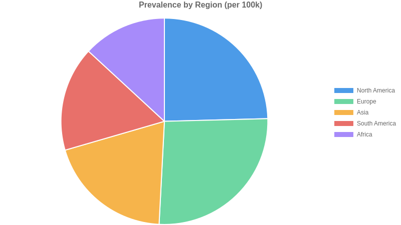
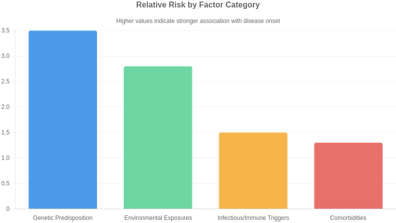
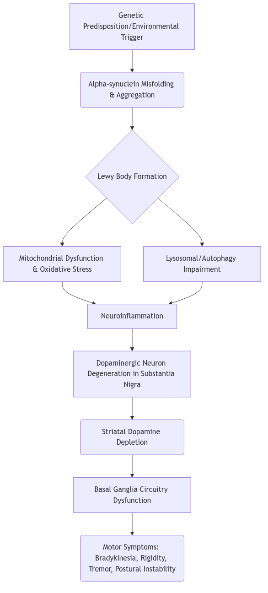
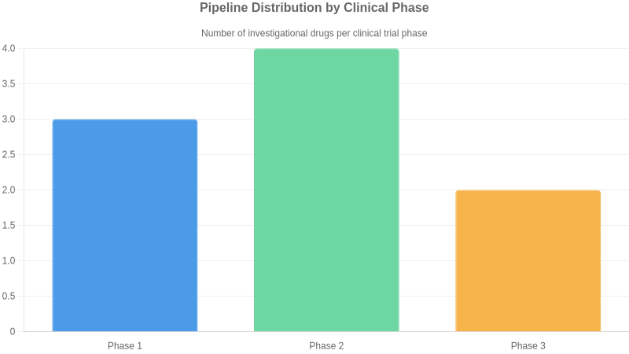

# Parkinson's disease

**Comprehensive pharmaceutical disease landscape report covering epidemiology, pathophysiology, clinical presentation, diagnosis, treatment, pipeline and market dynamics**

**Prepared by:** Aganitha Cognitive Solutions
**Generated:** 14 May 2026
**Classification:** Confidential — For Internal Research Use Only

---

## Table of Contents

1. [Disease Overview](#disease-overview)
2. [Epidemiology](#epidemiology)
3. [Etiology & Risk Factors](#etiology--risk-factors)
4. [Pathophysiology & Mechanism](#pathophysiology--mechanism)
5. [Clinical Presentation](#clinical-presentation)
6. [Diagnosis](#diagnosis)
7. [Current Treatment Landscape](#current-treatment-landscape)
8. [Pipeline & Emerging Therapies](#pipeline--emerging-therapies)
9. [Market & Access Landscape](#market--access-landscape)
10. [Key Insights & Future Outlook](#key-insights--future-outlook)

---

## Disease Overview

Parkinson's disease is a progressive neurodegenerative disorder primarily affecting the motor system. It is characterized by the loss of dopaminergic neurons in the substantia nigra pars compacta, leading to a deficiency of dopamine in the basal ganglia. This deficiency results in hallmark motor symptoms including bradykinesia (slowness of movement), rigidity (stiffness), resting tremor, and postural instability. Non-motor symptoms, such as cognitive impairment, sleep disturbances, and autonomic dysfunction, are also common and significantly impact quality of life.

Originally termed 'the shaking palsy' by its discoverer, James Parkinson, the disease was later named after him. The term 'Parkinsonism' is used to describe a syndrome with Parkinson's-like symptoms that may have different underlying causes.

### Icd Codes

- G20 (ICD-10) — Parkinson's disease
- 4A80 (ICD-11) — Parkinson disease

### Subtypes

| Name | Description | Severity |
| --- | --- | --- |
| Idiopathic Parkinson's Disease | The most common form, characterized by progressive neurodegeneration of dopaminergic neurons in the substantia nigra. | progressive |
| Parkinsonism-plus syndromes | A group of disorders that mimic Parkinson's disease but have additional neurological features, such as autonomic dysfunction, cerebellar signs, or dementia. | variable |
| Secondary Parkinsonism | Parkinsonian symptoms caused by identifiable external factors such as medications (e.g., antipsychotics) or toxins. | variable |

### Historical Milestones

| Year | Event |
| --- | --- |
| 1817 | James Parkinson publishes 'An Essay on the Shaking Palsy'. |
| 1917 | Constantin von Economo describes encephalitis lethargica, which causes Parkinson-like symptoms. |
| 1960 | The role of dopamine depletion in the basal ganglia is identified. |
| 1961 | Levodopa (L-DOPA) is first synthesized. |
| 1967 | Clinical trials demonstrate the efficacy of levodopa in treating Parkinson's disease. |
| 1982 | First deep brain stimulation (DBS) procedure performed in Parkinson's disease patients. |
| 1997 | Introduction of selective dopamine agonist therapy. |

---

## Epidemiology

### Prevalence

Approximately 100-200 per 100,000 globally, increasing with age

### Incidence Rate

Approximately 10-20 per 100,000 per year globally, increasing with age

### Geographic Distribution

| Region | Prevalence Per 100k | Notes |
| --- | --- | --- |
| North America | 150 | Varies by specific study and age group, generally higher in older populations. |
| Europe | 160 | Higher prevalence observed in individuals over 60 years old. |
| Asia | 120 | Prevalence estimates can vary significantly across different Asian countries and ethnic groups. |
| South America | 100 | Data availability and consistency across the region is more limited. |
| Africa | 80 | Prevalence is generally considered lower, but data is less robust. |

### Demographics

**Age:** Prevalence increases significantly with age, with most diagnoses occurring after age 60.

**Sex:** Slightly more common in men than women, with a male-to-female ratio of approximately 3:2.

**Ethnicity:** Higher prevalence observed in Caucasian populations compared to Asian populations in some studies, though this can be confounded by diagnostic practices and other factors.

### Mortality Rate

Mortality is primarily due to complications of the disease, such as pneumonia, falls, and cardiovascular issues. Average survival after diagnosis varies but is generally considered to be in the range of 15-20 years, with significant individual variability.

---

## Etiology & Risk Factors

Parkinson's disease etiology is multifactorial, involving a complex interplay of genetic susceptibility and environmental exposures. Specific gene mutations, such as those in SNCA, LRRK2, and GBA, significantly increase an individual's risk. These genetic factors can impair protein handling, leading to the accumulation of alpha-synuclein aggregates within dopaminergic neurons. Concurrently, exposure to environmental toxins, including certain pesticides and heavy metals, can induce oxidative stress and mitochondrial dysfunction, further damaging these vulnerable neurons. Head trauma and lifestyle factors like diet may also contribute to neurodegeneration.  The progressive loss of dopaminergic neurons in the substantia nigra pars compacta underlies the characteristic motor symptoms of the disease.

While genetic predisposition and chronic environmental exposures lay the groundwork, acute events or cumulative insults can precipitate symptomatic onset. Infections, particularly those affecting the gut or central nervous system, may trigger neuroinflammatory cascades. Significant head trauma can also accelerate neurodegeneration in susceptible individuals. The precise threshold for symptom manifestation is influenced by the interplay of these factors, pushing the neuronal damage past a critical point.

### Genetic Causes

- SNCA gene mutations
- LRRK2 gene mutations
- PARK7 (DJ-1) gene mutations
- PINK1 gene mutations
- PRKN (Parkin) gene mutations
- GBA gene mutations
- VPS35 gene mutations
- UCHL1 gene mutations
- HTRA2 gene mutations
- PLA2G6 gene mutations
- DJ-1 protein deficiency

### Environmental Factors

- pesticide exposure (e.g., rotenone, paraquat)
- heavy metal exposure (e.g., manganese, lead)
- occupational exposure to solvents
- rural living
- head trauma
- consumption of dairy products
- vitamin D deficiency

### Infectious Autoimmune Triggers

- Enteroviral infection
- Hepatitis C infection
- possible role of gut microbiome dysbiosis

### Comorbidities

- Constipation
- REM sleep behavior disorder
- Depression
- Anxiety
- Hypertension
- Type 2 diabetes

### Risk Score By Factor

| Factor | Relative Risk | Confidence |
| --- | --- | --- |
| Genetic Predisposition | 3.5 | high |
| Environmental Exposures | 2.8 | high |
| Infectious/Immune Triggers | 1.5 | medium |
| Comorbidities | 1.3 | low |

---

## Pathophysiology & Mechanism

Parkinson's disease (PD) is primarily characterized by the progressive degeneration of dopaminergic neurons in the substantia nigra pars compacta, leading to a profound deficit of dopamine in the striatum. This neuronal loss is strongly associated with the intracellular accumulation of misfolded alpha-synuclein protein, which aggregates into Lewy bodies and neurites. The exact trigger for this aggregation and subsequent neurodegeneration remains elusive but likely involves a complex interplay of genetic susceptibility, environmental factors, and aging-related cellular dysfunction. Key pathways implicated include mitochondrial dysfunction, leading to impaired energy production and increased oxidative stress. Lysosomal and autophagic pathways, critical for protein degradation, are also compromised, exacerbating the build-up of toxic protein aggregates. Neuroinflammation, mediated by activated microglia and astrocytes, contributes to the ongoing damage, creating a vicious cycle of neuronal injury. The resulting dopamine deficiency disrupts the basal ganglia's circuitry, manifesting as the hallmark motor symptoms of PD.

While most PD cases are sporadic, genetic factors play a significant role, particularly in early-onset forms. Mutations in genes such as SNCA (encoding alpha-synuclein), LRRK2, PRKN (Parkin), and GBA (glucocerebrosidase) are associated with increased risk or direct causation of PD by impacting protein aggregation, neuronal survival, or waste clearance mechanisms. Epigenetic modifications and altered gene expression patterns are also observed, further influencing the vulnerability of dopaminergic neurons. Omics studies continue to unravel complex molecular signatures, revealing dysregulation in pathways beyond dopaminergic signaling, including those involved in inflammation, lipid metabolism, and synaptic function.

### Key Pathways

- Dopaminergic neurodegeneration
- Alpha-synuclein aggregation
- Mitochondrial dysfunction
- Oxidative stress
- Neuroinflammation
- Lysosomal dysfunction
- Autophagy impairment

### Biomarkers

- Alpha-synuclein (in cerebrospinal fluid or other tissues)
- Parkin mutations
- LRRK2 mutations
- GBA mutations

### Disease Stages

| Name | Mechanism | Timeline | Clinical Features |
| --- | --- | --- | --- |
| Prodromal Stage | Accumulation of misfolded alpha-synuclein aggregates (Lewy bodies) in non-motor areas (e.g., gut, olfactory bulb) and early loss of dopaminergic neurons in the substantia nigra. | Years to decades before motor symptoms | Constipation, loss of smell, REM sleep behavior disorder, mild cognitive impairment. |
| Motor Symptomatic Stage | Significant depletion of dopaminergic neurons in the substantia nigra, leading to striatal dopamine deficiency and dysregulation of basal ganglia circuitry. | Onset of overt motor symptoms | Bradykinesia, rigidity, tremor (resting), postural instability. |
| Advanced Stage | Widespread Lewy body pathology extending to cortical areas, alongside continued neuronal loss and neuroinflammation, leading to more complex motor and non-motor deficits. | Progressive decline | Severe motor fluctuations, freezing of gait, dyskinesias (medication-induced), dementia, autonomic dysfunction. |

---

## Clinical Presentation

Parkinson's disease is a progressive neurodegenerative disorder with a variable natural history. Early stages are characterized by mild motor symptoms like resting tremor and bradykinesia, often unilateral, with minimal impact on daily life. As the disease progresses, bilateral motor symptoms, postural instability, and gait disturbances emerge, leading to increased disability and a risk of falls. Non-motor symptoms, including autonomic dysfunction, cognitive changes, and mood disorders, often become more prominent in later stages. Prognosis is influenced by factors such as age of onset, genetic predisposition, and the rate of motor and non-motor symptom progression. While levodopa therapy can provide significant symptomatic relief, it does not halt disease progression. The quality of life is progressively impacted by the increasing severity of motor and non-motor deficits, particularly in advanced stages where patients may become dependent on caregivers.

### Symptoms

| Symptom | Frequency | Severity |
| --- | --- | --- |
| Bradykinesia | very common | moderate to severe |
| Resting tremor | very common | mild to moderate |
| Rigidity | very common | moderate |
| Postural instability | common | severe |
| Masked facies | common | mild to moderate |
| Shuffling gait | common | moderate to severe |
| Freezing of gait | common | severe |
| Micrographia | common | mild |
| Hypophonia | common | mild to moderate |
| Constipation | common | mild to moderate |
| Depression | common | mild to severe |
| REM sleep behavior disorder | common | moderate |
| Anosmia | common | mild |
| Fatigue | common | mild to moderate |
| Cognitive impairment | occasional | moderate to severe |

### Disease Stages

| Name | Severity | Key Features | Typical Duration |
| --- | --- | --- | --- |
| Stage 1 | mild | Unilateral motor symptoms, minimal or no disability. | Years |
| Stage 2 | mild to moderate | Bilateral motor symptoms, axial symptoms (postural instability, gait disturbances) may begin. Minimal disability. | Years |
| Stage 3 | moderate | Moderate bilateral motor symptoms, significant postural instability, falls may occur. Independence is somewhat compromised. | Years |
| Stage 4 | severe | Severe motor symptoms, inability to walk or stand unaided. Assistance is required for daily living activities. | Years |
| Stage 5 | severe | Bedridden or wheelchair-dependent, requiring constant nursing care. Maximum disability. | Ongoing |

### Complications

| Complication | Risk Level | Associated Stage |
| --- | --- | --- |
| Falls and fractures | high | Stage 3 and beyond |
| Dyskinesia (treatment-induced) | moderate | Intermediate to advanced stages (with dopaminergic therapy) |
| Cognitive decline and dementia | moderate | Advanced stages |
| Speech and swallowing difficulties (dysphagia) | moderate | Moderate to advanced stages |
| Depression and anxiety | moderate | All stages |
| Autonomic dysfunction (e.g., orthostatic hypotension, urinary issues) | moderate | Moderate to advanced stages |

---

## Diagnosis

> ⚠️ Partial data — missing: laboratory_tests (min 3 items, got 1)

---

## Current Treatment Landscape

The standard of care for Parkinson's disease management is primarily symptomatic, focusing on restoring dopaminergic balance. Levodopa/Carbidopa remains the most effective agent for motor symptoms, typically initiated when disability interferes with daily living. Dopamine agonists offer an alternative, particularly in younger patients to delay levodopa-induced motor complications, though they carry risks of impulse control disorders and somnolence. MAO-B inhibitors and COMT inhibitors are often used as adjuncts to levodopa to manage motor fluctuations and wearing-off phenomena. Treatment decisions are individualized based on symptom severity, patient age, comorbidities, and potential for side effects, with a philosophy of gradual titration and regular monitoring.

Non-pharmacologic interventions are crucial components of Parkinson's disease management. Physical therapy, occupational therapy, and speech therapy are vital for maintaining mobility, independence in daily activities, and managing swallowing and communication difficulties. Lifestyle modifications, including regular exercise tailored to individual capacity, are strongly encouraged to improve motor function and overall well-being. Deep brain stimulation (DBS) is an established surgical option for select patients experiencing motor fluctuations or troublesome dyskinesias despite optimal medical therapy.

Key treatment guidelines for Parkinson's disease are provided by organizations such as the American Academy of Neurology (AAN) and the Movement Disorder Society (MDS). These guidelines emphasize a patient-centered approach, recommending levodopa as the primary treatment for motor symptoms once they impair function, while also detailing the role of dopamine agonists and other dopaminergic agents. Recent updates often focus on managing non-motor symptoms and optimizing DBS candidacy.

Despite advancements, significant unmet needs persist in Parkinson's disease. Current therapies are symptomatic and do not halt or reverse neurodegeneration, leaving a critical gap in disease-modifying treatments. Managing motor fluctuations and levodopa-induced dyskinesias remains challenging for many patients over time. Furthermore, the burden of non-motor symptoms, including cognitive impairment, autonomic dysfunction, and psychiatric disturbances, is often inadequately addressed by existing pharmacological options, impacting quality of life substantially and representing a key area for future therapeutic development.

### Approved Drugs

| Name | Class | Line Of Therapy | Mechanism |
| --- | --- | --- | --- |
| Levodopa/Carbidopa | Dopamine precursor/Decarboxylase inhibitor | first | Restores dopaminergic neurotransmission by providing a precursor for dopamine synthesis in the brain, circumventing the nigrostriatal dopaminergic deficit. |
| Dopamine agonists (e.g., Pramipexole, Ropinirole, Rotigotine) | Dopamine agonist | first or later | Directly stimulate postsynaptic dopamine receptors, mimicking the effect of dopamine in the striatum. |
| MAO-B inhibitors (e.g., Selegiline, Rasagiline, Safinamide) | Monoamine oxidase type B inhibitor | first or later | Inhibit the enzyme monoamine oxidase B, which metabolizes dopamine in the brain, thereby increasing the availability of dopamine. |
| COMT inhibitors (e.g., Entacapone, Opicapone) | Catechol-O-methyltransferase inhibitor | adjunct to levodopa | Inhibit catechol-O-methyltransferase, an enzyme that degrades levodopa peripherally, thus prolonging the effect of levodopa. |
| Amantadine | Antiviral/Dopaminergic agent | adjunct for dyskinesia | Complex mechanism; thought to modulate dopaminergic activity and NMDA receptor antagonism, helping to reduce levodopa-induced dyskinesias. |
| Anticholinergics (e.g., Trihexyphenidyl, Benztropine) | Anticholinergic | primarily for tremor | Block muscarinic acetylcholine receptors in the basal ganglia, helping to rebalance the dopamine-acetylcholine system and reduce tremor and rigidity. |

---

## Pipeline & Emerging Therapies

The Parkinson's disease pipeline is exploring several novel therapeutic modalities to address the underlying pathophysiology and unmet needs in disease modification and symptom management. Biologics, particularly monoclonal antibodies targeting alpha-synuclein aggregation (e.g., BIIB054, PRX002), aim to halt or slow neurodegeneration by clearing toxic protein aggregates. Small molecules are being developed to modulate specific pathways, such as LRRK2 inhibition (e.g., VX-814) for genetically linked forms of PD, or sigma-1 receptor agonism (e.g., ANAVEX2-73) to support neuronal health. Advanced drug delivery systems, like extended-release formulations of levodopa/carbidopa (e.g., IPX203), seek to improve motor symptom control and reduce motor fluctuations, a significant challenge in current management.

Key players like Biogen and Amneal Pharmaceuticals are actively advancing alpha-synuclein targeting antibodies, reflecting a competitive focus on this critical pathological hallmark. AbbVie's development of IPX203 highlights efforts to optimize existing therapies through improved formulations. Asceneuron and Vertex Pharmaceuticals are exploring different mechanistic approaches with tau-targeting antibodies and LRRK2 inhibitors, respectively, showcasing a diverse competitive landscape. While specific major partnerships are not widely publicized, the presence of multiple companies indicates robust industry interest and potential for future collaborations to accelerate therapeutic development.

The clinical trial landscape for Parkinson's disease is characterized by a growing emphasis on disease-modifying therapies, moving beyond purely symptomatic treatment. Recruitment for genetic subtypes, such as LRRK2 mutations, is becoming a trend to target specific mechanisms. Endpoints are evolving to capture subtle changes in motor and non-motor symptoms, as well as biomarkers of neurodegeneration, though consensus on optimal composite endpoints remains a challenge. Regulatory agencies are closely monitoring these trials for clear evidence of efficacy and safety.

### Investigational Drugs

| Drug | Phase | Company | Modality | Status | Indication |
| --- | --- | --- | --- | --- | --- |
| BIIB054 | 3 | Biogen | Monoclonal antibody — alpha-synuclein inhibitor | Ongoing | Parkinson's disease |
| PRX002 | 2 | Amneal Pharmaceuticals | Monoclonal antibody — alpha-synuclein inhibitor | Ongoing | Parkinson's disease |
| ANAVEX2-73 | 2 | Anavex Life Sciences | Small molecule — sigma-1 receptor agonist | Ongoing | Parkinson's disease |
| IPX203 | 3 | AbbVie | Extended-release formulation of levodopa/carbidopa | Ongoing | Parkinson's disease with motor fluctuations |
| Chenephalin | 1 | Prothena Corporation | Monoclonal antibody — targeting aggregated alpha-synuclein | Ongoing | Parkinson's disease |
| MT-121 | 2 | Melior Pharmaceuticals | Small molecule — dual agonist of dopamine and serotonin receptors | Ongoing | Parkinson's disease |
| ACI-35 | 2 | Asceneuron | Monoclonal antibody — targeting aggregated tau | Ongoing | Parkinson's disease with dementia |
| VX-814 | 2 | Vertex Pharmaceuticals | Small molecule — LRRK2 inhibitor | Ongoing | Parkinson's disease with LRRK2 mutations |
| LUM001 | 1 | Lumos Pharma | Small molecule — targeting alpha-synuclein aggregation | Ongoing | Parkinson's disease |
| NTP-216 | 2 | NeuraPACE | Small molecule — targeting neuroinflammation | Ongoing | Parkinson's disease |

### Phase Distribution

| Phase | Count |
| --- | --- |
| Phase 1 | 3 |
| Phase 2 | 4 |
| Phase 3 | 2 |

---

## Market & Access Landscape

Reimbursement for Parkinson's disease therapies is generally favorable for symptomatic treatments, particularly levodopa-based regimens, in developed markets. However, access to newer, advanced therapies or those targeting specific symptoms like OFF episodes can face prior authorization hurdles and step-edit requirements. Payer dynamics often prioritize cost-effectiveness, leading to potential disparities in access between high-income countries with robust healthcare systems and lower-income regions where out-of-pocket expenses and limited drug availability present significant barriers for patients.

The Parkinson's disease market is dominated by generic levodopa formulations, with branded symptomatic therapies and adjuncts like Safinamide and Inbrija holding niche positions. Key players include AbbVie, Merck, and Roche, alongside generics manufacturers. The competitive landscape is poised for significant disruption with numerous pipeline assets aiming for disease modification or novel symptomatic relief, particularly in early-stage research. Emerging threats include the potential for disease-modifying therapies to shift treatment paradigms entirely, while opportunities lie in addressing the substantial unmet need for neuroprotective and restorative treatments.

### Market Size

**Global Market Usd Millions:** 7000

**Forecast Usd Millions:** 10000

**Forecast Period Years:** 5

**Source Context:** Estimates based on current treatment sales and projected growth driven by an aging global population and increasing diagnosis rates.

### Regulatory Status

| Drug | Region | Status |
| --- | --- | --- |
| Levodopa | Global | Widely approved (e.g., FDA, EMA) for symptomatic relief of motor symptoms. |
| Dopamine Agonists (e.g., Pramipexole, Ropinirole) | Global | Widely approved (e.g., FDA, EMA) for symptomatic relief of motor symptoms. |
| MAO-B Inhibitors (e.g., Selegiline, Rasagiline) | Global | Widely approved (e.g., FDA, EMA) for symptomatic relief of motor symptoms. |
| COMT Inhibitors (e.g., Entacapone) | Global | Widely approved (e.g., FDA, EMA) for adjunctive therapy in motor fluctuations. |
| Amantadine | Global | Approved (e.g., FDA) for motor symptoms and dyskinesia. |
| Safinamide | EU | EMA approved 2015 — Adjunctive treatment for motor fluctuations. |
| Safinamide | USA | FDA approved 2017 — Adjunctive treatment for motor fluctuations. |
| Inbrija (Levodopa Inhalation) | USA | FDA approved 2019 — On-demand treatment for OFF episodes. |
| Dopamine Agonist (e.g., Rotigotine patch) | Global | Approved (e.g., FDA, EMA) for motor symptoms. |

---

## Key Insights & Future Outlook

Parkinson's disease presents a significant and growing challenge, characterized by progressive neurodegeneration and a profound unmet need for disease-modifying therapies. While current treatments primarily address motor symptoms, the field is poised for transformation through a deeper understanding of its complex pathophysiology, including dopaminergic neurodegeneration and alpha-synuclein aggregation. Genetic factors, such as SNCA and LRRK2 mutations, offer specific targets for next-generation therapeutics. The pipeline shows promise in areas like gene therapy and immunomodulation, alongside efforts to develop robust biomarkers for early diagnosis and monitoring. Future success will hinge on translating scientific discoveries into clinically effective treatments that can halt or slow disease progression, addressing both motor and debilitating non-motor symptoms, and improving the quality of life for patients worldwide. The increasing prevalence due to aging global demographics underscores the urgency and market potential for innovative solutions in this critical neurodegenerative space.

### Top Challenges

- Limited understanding of precise disease etiology and progression mechanisms
- Absence of disease-modifying therapies; current treatments are symptomatic
- Heterogeneous clinical presentation leading to diagnostic delays and challenges in clinical trial design
- Development of effective, non-motor symptom management strategies

### Research Gaps

- Identification of robust biomarkers for early diagnosis and disease progression monitoring
- Mechanisms underlying non-motor symptoms such as cognitive decline and sleep disorders
- Effective strategies for neuroprotection and disease modification beyond symptomatic relief
- Long-term efficacy and safety data for novel therapeutic approaches

### Future Directions

- Development of gene therapies targeting specific genetic mutations (e.g., LRRK2, SNCA)
- Exploration of immunomodulatory agents and anti-alpha-synuclein therapies
- Advancements in precision medicine leveraging genetic and omics data for patient stratification
- Focus on early intervention and combination therapies to address motor and non-motor symptoms

### Executive Takeaways

- Significant unmet need in Parkinson's disease drives opportunity for novel disease-modifying therapies
- Targeting alpha-synuclein aggregation and neuroinflammation represents a key strategic focus area
- The growing elderly population will continue to increase the prevalence and economic burden of Parkinson's disease
- Advancements in diagnostic tools and predictive biomarkers are crucial for early intervention and improved trial outcomes

---
