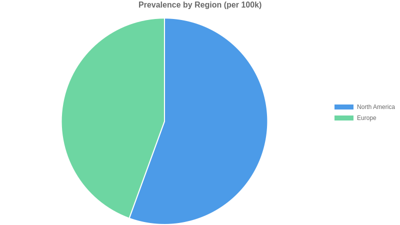
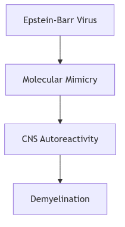

<!-- _class: cover -->

# Alzheimer's disease

## Disease Report

Prepared by Aganitha Cognitive Solutions · 14 May 2026
Confidential — AI-generated report for internal research use only

---

---
marp: true
theme: default
_class: cover
---

# Disease Overview
## Systemic Lupus Erythematosus (SLE)

---

<!-- _class: insights -->

# Clinical Definition & Key Features

### Definition
- **Chronic Multisystem Disorder**: A complex autoimmune condition affecting various organ systems.
- **Pathophysiology**: Driven by a fundamental **loss of self-tolerance**.
- **Autoantibody Production**: Characterized by **pathogenic autoantibodies** targeting various nuclear antigens.

### Primary Manifestations
- **Butterfly Rash**: Classic malar distribution across the cheeks and nose.
- **Joint Pain**: Frequent inflammatory involvement.
- **Kidney Involvement**: Significant risk of renal complications.
- **Photosensitivity**: UV-induced skin reactions and flares.

---
---

---
<!-- _class: img-right -->

# Epidemiology: Global Burden & Demographics

- **Global Prevalence**: Approximately **100 per 100,000** (1 in 1,000).
- **Annual Incidence**: **5.1 per 100,000** new cases per year.
- **Primary Demographic**: Highest onset between **15–45 years**.
- **Sex Distribution**: Striking **9:1 female-to-male** ratio.
- **Risk Factors**: Significant increase in prevalence among **African American and Hispanic** women.

---

<!-- _class: data -->

# Geographic & Regional Distribution

| Region | Prevalence (per 100k) | Observations |
| :--- | :---: | :--- |
| **North America** | 150 | Peak prevalence; notably high in minority ethnic groups. |
| **Europe** | 120 | Higher frequency observed in **Southern Europe**. |

---

<!-- _class: insights -->

# Key Epidemiological Insights

- **Gender Predominance**: The disease is characterized by a profound female bias, suggesting hormonal or genetic predispositions linked to the X chromosome.
- **Ethnic Disparity**: North American data highlights a disproportionate burden on **African American and Hispanic** populations, requiring targeted clinical awareness.
- **Geographic Gradient**: Prevalence rates vary by latitude and region, with higher clusters identified in North America compared to European cohorts.
---

---

<!-- _class: cover -->

# Etiology & Risk Factors
## Understanding the Origins of Multiple Sclerosis (MS)

---

<!-- _class: img-right -->

# Pathogenesis & Mechanism
### How Genetic and Environmental Factors Converge

- **Multifactorial Origin**: Result of a complex convergence between **polygenic risk profiles** and specific **environmental catalysts**.
- **Neuroinflammatory Focus**: Characterized as a primary neuroinflammatory disease driven by immune dysregulation.
- **Key Pathological Chain**:
  - Initial infection (e.g., **EBV**)
  - Induction of **molecular mimicry**
  - Activation of **CNS autoreactivity**
  - Progressive **demyelination**

---

<!-- _class: insights -->

# Key Risk Drivers
### Quantitative Relative Risk (RR) and Clinical Impact

- **Infectious Triggers**: 
  - The strongest identified risk factor (**Relative Risk: 32.4**).
  - High confidence evidence links specific viral agents to disease onset.
- **Genetic Predisposition**: 
  - Significant hereditary contribution (**Relative Risk: 3.1**).
  - Polygenic susceptibility provides the "primer" for environmental triggers.
- **Clinical Insight**: 
  - The high RR for infectious triggers suggests that while genetics provide susceptibility, **environmental exposure** is often the primary driver for active disease.

---

<!-- _class: data -->

# Risk Factor Summary

| Factor Category | Relative Risk | Confidence Level | Primary Mechanism |
| :--- | :--- | :--- | :--- |
| **Infectious Trigger** | 32.4 | High | Molecular Mimicry |
| **Genetic** | 3.1 | High | Polygenic Susceptibility |
| **Autoimmune** | — | — | CNS Autoreactivity |

**Summary**: Disease onset is defined by **CNS autoreactivity** triggered by external agents in genetically susceptible individuals.